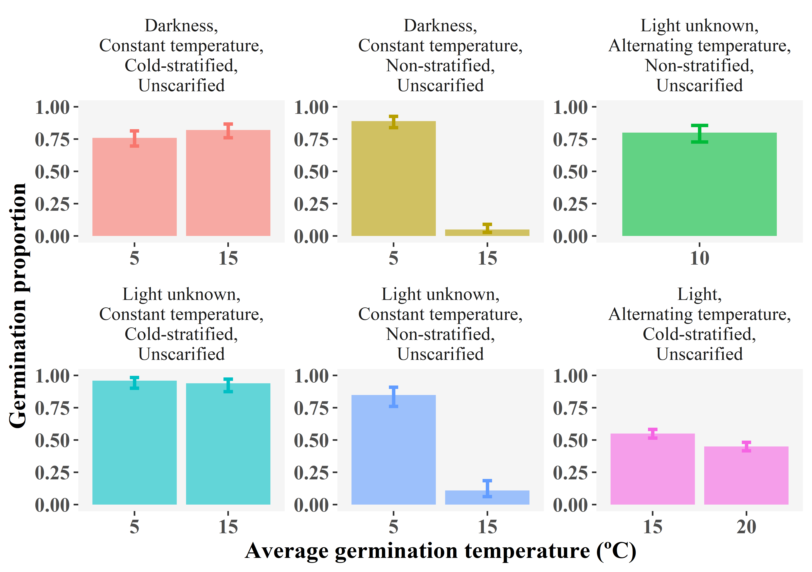

SylvanSeeds, a seed germination database for temperate deciduous forests
================

**Author:** Eduardo Fernández-Pascual **Institutional address:**
Departamento de Biología de Organismos y Sistemas, Universidad de
Oviedo, C/ Catedrático Rodrigo Uría, 33006 Oviedo/Uviéu, Spain
**Email:** <efernandezpascual@gmail.com> **Telephone:** +34985104787

# Abstract

Seed traits have functional significance in all levels of plant biology,
but there is a lack of germination databases of wide geographical scope.
This report presents *SylvanSeeds*
(<https://efernandezpascual.github.io/home/sylvanseeds.html>), a first
global database of germination records for an ecologically coherent
unit: Temperate Broadleaf and Mixed Forests. Data were gathered with a
systematic literature search. A list of frequent taxa of the study area
was created using 14,963 vegetation relevés from the sPlot database. The
list was searched in the Web of Science. 6,791 references were screened,
finding 555 articles from which data were extracted. *SylvanSeeds*
includes 4,012 germination records of 334 species from 72 families
(gymnosperms and angiosperms), collected in 46 countries between
1920-2017. It provides raw data for meta-analysis: proportions of seeds
germinated in laboratory experiments of scarification, stratification,
light-darkness, and constant-alternating temperatures. *SylvanSeeds* is
freely distributed as a *.csv*. A shiny web app is also presented, to
make data accessible to the public. *SylvanSeeds* advances functional
seed ecology and brings two innovations to plant science. First, the
data-gathering methodology can be extended to other biomes. Second,
database and app can be a standard in further efforts to compile
germination data.

**Keywords:** germination database, germination temperature, light and
dark germination, nemoral, seed dormancy, seed traits, temperate
broadleaf and mixed forests, temperate evergreen forests

# Introduction

Seed traits have functional significance in all levels of plant ecology,
from population dynamics (Huang et al. [2016](#ref-RN3043)) to community
assembly (Larson & Funk [2016](#ref-RN2942)) and species distributions
(Larson & Funk [2016](#ref-RN2942)). Recent discussions (Jiménez-Alfaro
et al. [2016](#ref-RN2352); Saatkamp et al. [2019](#ref-RN4655))
highlighted the lack of reliable germination databases of wide
geographical scope as a major limitation to produce a global synthesis
of the seed ecological spectrum. Seed germination is the first major
developmental transition in the life of a plant, and it has profound
effects on the plant’s ecology (Donohue et al. [2010](#ref-RN2384)). As
such, the timing of this transition is controlled by a combination of
environmental signals. Amongst these are temperature (Fernández-Pascual
et al. [2019](#ref-RN2249)), diurnal temperature alternation (Thompson
et al. [1977](#ref-RN2217)), light (Carta et al. [2017](#ref-RN4656))
and seed dormancy inductors and relievers (Finch-Savage &
Leubner-Metzger [2006](#ref-RN3063)). All these signals interact to
produce a coarse- and fine-scale regulation of germination timing,
integrating inputs from both seasonal climatic cycles (Jurado & Flores
[2005](#ref-RN3132)) and local environmental gradients
(Fernández-Pascual et al. [2017](#ref-RN2865)). The practical
consequence of this is that the response of seeds to, for example, light
will depend on other conditions set by the experimenter. This makes it
difficult to summarise germination “traits” into a single value in a way
comparable to seed mass, specific leaf area or plant height
(Pérez-Harguindeguy et al. [2013](#ref-RN2923)), and may explain the
lack of global germination databases. Germination compilations with a
biogeographical background, of which the prime example today is the
cornerstone book of Baskin and Baskin ([2014](#ref-RN3214)), only
provide summary information, for instance the interpreted optimal
germination temperature instead of the proportion of seeds germinated
across a temperature gradient.

To fill this gap, this article presents *SylvanSeeds*, a first global
database of raw germination data for an ecologically and
biogeographically coherent unit: the temperate broadleaf and mixed
forests biome (Olson et al. [2001](#ref-RN4667)) of the northern
hemisphere (hereafter shortened to nemoral biome). Nemoral forests are
dominant in temperate latitudes with mild to cold winters and relatively
warm and wet summers, corresponding with the Cf climate in Köppen’s
classification (mild temperate, fully humid) (Beck et al.
[2018](#ref-RN4932)). Generally, these forests are characterized by some
frost events during the winter while summers are moist and do not suffer
drought for any relevant length of time, conditions that favour the
dominance of broadleaf deciduous trees (Givnish [2002](#ref-RN4931)). In
the northern hemisphere, they also form a coherent evolutionary and
biogeographic unit, sharing a common Tertiary history until they became
separated between North America, Asia and Europe (Milne & Abbott
[2002](#ref-RN4684)). At the same time, a relatively high number of
classic seed biology research groups have worked within the nemoral
biome areas, e.g. in the USA (Baskin & Baskin [2014](#ref-RN3214)), the
UK (Grime et al. [1981](#ref-RN3273)), Belgium (Van Assche & Vandelook
[2006](#ref-RN656)) and Japan (Washitani [1988](#ref-RN1188)). To create
*SylvanSeeds*, a systematic literature search (Koricheva et al.
[2013](#ref-RN2401)) was applied to a list of frequent species
representing the flora of the nemoral biome. This article makes the
database accessible to the research community. Additionally, the
*SylvanSeeds* shiny web app is presented to facilitate the exploration
of the data.

# Materials and Methods

## Frequent species list

A systematic approach was followed to search for data, with the purpose
of prioritising work and maximising its utility for vegetation science.
In short, this approach consisted in (i) obtaining a representative
number of vegetation plots for the biome from sPlot
(<https://www.idiv.de/en/splot.html>); and (ii) using the plots to
produce a list of frequent species (i.e. species that occur in at least
5% of the plots of a region).

A list of species for which to search germination data was created using
vegetation relevés (i.e. records of plant species co-occurring in
sampling plots) from *sPlot* (Bruelheide et al. [2019](#ref-RN4658)).
The terrestrial regionalization of the *World Wildlife Fund* (Olson et
al. [2001](#ref-RN4667)) was used to select plots according to their
coordinates. To ensure that plots were a representative sample of
nemoral biome biodiversity, they were chosen from 17 ecoregions of the
Temperate Broadleaf and Mixed Forests biome distributed throughout the
northern hemisphere: (*Appalachian mixed mesophytic forests*, *Atlantic
mixed forests*, *Cantabrian mixed forests*, *Caspian Hyrcanian mixed
forests*, *Central Korean deciduous forests*, *Dinaric Mountains mixed
forests*, *Euxine-Colchic broadleaf forests*, *Hokkaido deciduous
forests*, *Manchurian mixed forests*, *Nihonkai evergreen forests*,
*Nihonkai montane deciduous forests*, *Pindus Mountains mixed forests*,
*Southeastern mixed forests*, *Taiheiyo evergreen forests*, *Taiheiyo
montane deciduous forests*, *Western European broadleaf forests*,
*Western Great Lakes forests*). Although temperate broadleaf and mixed
forests also occur in a smaller area of the southern hemisphere, these
southern forests form a separate evolutionary and biogeographical unit,
not being related by a common history like the northern hemisphere ones
(Milne & Abbott [2002](#ref-RN4684)). For this reason, they were not
considered.

All chosen relevés had been classified as forest plots by *sPlot*,
i.e. their plant cover was dominated by tree species. The taxa names
were standardized to species level with *The Plant List*
([2013](#ref-RN2321)) using the *Taxonstand* package (Cayuela et al.
[2019](#ref-RN4660)) in *R* (R Core Team [2019](#ref-RN2315)). The final
vegetation database contained 14,963 relevés and 7,133 standardized
species names, considering only seed plants (gymnosperms and
angiosperms), and encompassing all forest layers. To obtain the final
list of species, only species that were present in at least 5% of the
relevés of an ecoregion were kept, rendering a list of 1,270 frequent
species. There were two reasons to use this frequency threshold: (i) it
made the search achievable with the resources available; and (ii) it
filtered out rare species that may not be representative of the nemoral
biome, and which could have been recorded for a variety of reasons
(wrong taxonomical identifications, mistakes in plot coordinates, border
areas, unnatural areas such as parks, etc.). The result is a list of
plant species that occur with relatively high frequency in forest plots
of the nemoral biome; this includes trees, shrubs and shade-tolerant
forbs and grasses, as well as common semi-open species from forest
margins, secondary forests, ruderalized forest plots, etc.

## Web of Science literature search

The list of frequent species (plus the synonyms recorded in the relevés)
was incorporated into a Boolean search string, together with the words
“(seed OR seeds) AND (dormancy OR germination)”. This string was
searched in the *Thompson Reuters Web of Science* on 5 Mar 2019,
returning 6,791 results. The processing of these results is described in
a PRISMA flow diagram [(**Appendix
S1**)](https://github.com/efernandezpascual/sylvanseeds/blob/master/doc/Appendices%20S1-S4.pdf).
A first filter of the results by the relevance of the title retained
1,489 references. An effort was made to access the full text of all
these references, using the following channels: (i) “Find Full Text”
functionality in *EndNote X9*, (ii) online access to the journals using
the institutional subscriptions of the University of Oviedo; (iii)
request to the authors through *ResearchGate*; (iv) general search of
*pdf* files in *Google* using the article details. Unfortunately, 236
references could not be accessed. Most of these belonged to smaller
publishers not included in the subscriptions of the University of
Oviedo, and to older journal issues which had not been digitalised. The
resources of this project did not make it possible to further pursue
these references, but they are included as a *BibTeX* file [(**Appendix
S2**)](https://github.com/efernandezpascual/sylvanseeds/blob/master/doc/Appendices%20S1-S4.pdf)
in case they can be processed in the future. The found texts were
accessed to retrieve data for the database. At this stage, references
were considered to be non-relevant if they (i) did not pertain to
species in the original frequent species list; (ii) did not study
germination in species monocultures (e.g. competition studies); (iii)
did not report the minimal information needed (number of seeds sown,
germination percentage and germination temperature). Records were also
excluded when they pertained to special germination treatments that do
not allow for general comparisons (i.e. use of germination promoters
such as the plant hormone gibberellic acid; drought treatments,
including polyethylene glycol solutions; application of heavy metals or
other pollutants; smoke-related germination promoters such as
karrikins). Of the accessed references, 698 were non-relevant (*BiBTeX*
file in [**Appendix
S3**](https://github.com/efernandezpascual/sylvanseeds/blob/master/doc/Appendices%20S1-S4.pdf))
and 555 provided relevant data (*BiBTeX* file in [**Appendix
S4**](https://github.com/efernandezpascual/sylvanseeds/blob/master/doc/Appendices%20S1-S4.pdf)).

The systematic approach applied may fail to capture references on
species belonging to the nemoral biome for three reasons: (1) the
species is not recorded in the vegetation database; (2) the species has
been recorded, but it is infrequent (see above the frequency criterion);
or (3) the species is recorded and frequent and goes into the list, but
the relevant germination references are not found by the web search
because the species name is not mentioned in the title or the abstract.
While points 1 and 2 are intentionally excluded by the applied
methodology, point 3 would be a failure of the methodology
(specifically, a failure of the search string to find a relevant paper).
For this reason, a protocol was applied to detect the importance of
point 3, using the book of Baskin and Baskin ([2014](#ref-RN3214)) as a
reference. After completing the database, species names in the frequent
species list for which no relevant papers had been found were searched
in the taxonomical index of the Baskin and Baskin book. There were 273
species with missing data and mentioned by Baskin and Baskin in their
index. A random sample of 10% of these species were selected, and their
references as mentioned in the book were searched. All of them were
found to be either inaccessible (national journals or old conference
proceedings not available online) or to have no relevant data
(i.e. provided no primary germination data that could be retrieved).
From this trial, it was concluded that the search string had found a
reasonable amount of the available information, by comparing it to the
best reference available, the review book of Baskin and Baskin.

## Recording of the database

For each relevant reference, three blocks of information were recorded.
The first block described the plant material, including the species, the
populations that had been sampled, the year of sampling (or the year of
publication if that information was missing), the country, the
geographical coordinates (if not provided in the reference, the closest
available toponyms were searched in *Google Maps*; in some cases the
only geographical information was the country, in these cases the
coordinates of the capital city were recorded). The second block
described the experimental conditions: experimental setting (greenhouse,
incubator or room temperature), germination substrate and
characteristics of the containers, seed storage, application of seed
sterilization or nutrients, length of the germination incubations, use
of stratification (none, cold \[\< 15ºC\], warm \[\>= 15ºC\] or
combinations of cold and warm), use of scarification, photoperiod,
maximum germination temperature, minimum germination temperature, and
weighted average germination temperature. The third block contained the
final germination proportion: the reported final germination percentages
(retrieved from the text, tables or figures) and the reported number of
replicates and seeds per replicate were used to calculate a count of
seeds sown and a count of seeds germinated.

# Results

## Summary of contents

The final database contains 4,012 records (germination proportions for a
given seed lot of a species, recorded in a set of experimental
conditions) from 555 references. The plant materials had been collected
across the Temperate Broadleaf and Mixed Forest biome and surrounding
areas (**Fig. 1**), in both hemispheres. Although the frequent species
list was created using only relevés from the northern hemisphere, the
web search of germination articles found studies of those species that
had been performed in the southern hemisphere. These records are
included in the database, and their geographical origin is reported. The
oldest record was from 1920 and the top three contributing countries
were the USA (780), the UK (543) and Japan (531). There were 334 species
represented, from 72 seed plant families. The total estimate of seeds
used in the experiments was 746,947. The range of germination
temperatures (weighted average of the daily thermoperiod) went from -1
to 43 ºC, with 1,628 records of constant temperatures and 2,384 of
alternating temperatures. Light was used in 2,524 records, darkness in
1,107 and 381 did not provide information on this parameter. The
experiments were performed with unstratified seeds in 2,607 records, and
of the rest, the majority (1,232) went through cold stratification.
Scarification was applied to 248 records.

**Figure 1** *Geographical distribution of the germination records in
the database. Each golden circle is a record. The green areas correspond
to the extension of the Temperate Broadleaf and Mixed Forests biome
according to the *WWF*.*

## Database file

The database is provided as a *csv* file, comma separated [(**Appendix
S5**)](https://github.com/efernandezpascual/sylvanseeds/blob/master/doc/Appendix%20S5%20-%20Database.csv).
The first row of the file contains the header data, with the following
variables: *Taxon* (the original species names, as used in the
references), *TPLName* (*The Plant List* species names), *Family* (the
botanical family of the species), *Reference* (bibliographic source of
the record), *Year* (year the seed lot was collected), *Country*
(country where the seed lot was collected), *Population* (geographical
information of the seed lot), *Latitude* (approximated latitude where
the seed lot was collected, in decimal degrees), *Longitude*
(approximated longitude where the seed lot was collected, in decimal
degrees), *Dry\_storage* (binary variable indicating whether the seed
lot was kept at dry storage for more than a month between seed
collection and start of the experiments), *Setting* (environs used to
control germination temperature: either a greenhouse, a
climatically-controlled incubator, or room temperature), *Sterilization*
(note on surface sterilization treatments applied to the seed lot before
the experiments), *Nutrients* (note on nutrient application to the
germination substrate), *Substrate* (substrate used to hold the seeds
during the germination incubation), *Container\_type* (type of container
used to hold the substrate and the seeds during the experiments),
*Container\_size* (dimensions of the germination containers),
*Container\_number* (number of germination containers used for the
treatment), *Number\_per\_container* (number of seeds sown in each
container), *Incubation\_days* (number of days between the start of the
experiment, not including stratification, and the last day when
germinated seeds were counted), *Scarification* (binary variable
indicating whether the seed lot was scarified before the test),
*Stratification\_days* (number of days the seed lot was exposed to any
type of stratification, before the test), *Stratification\_temperature*
(temperature or temperatures used during the stratification treatment,
in degrees Celsius), *Stratification\_type* (type of stratification,
which can be none, cold, warm or combinations of cold and warm),
*Stratification* (binary variable indicating whether the seed lot was
stratified or not before the test), *Light* (binary variable indicating
whether the seed lot was germinated in light or in darkness),
*Photoperiod* (number of hours of exposure to light in the daily
photoperiod), *Alternating* (binary variable indicating whether the
germination test was conducted under constant or alternating
temperatures), *Tdif* (difference in degrees between the hottest and the
coldest temperatures of the daily thermoperiod), *Tmax* (hottest
temperature in the daily thermoperiod), *Tmin* (coldest temperature in
the daily thermoperiod), *Tmean* (mean germination temperature, weighted
by the length of each phase of the daily thermoperiod), *Temperature*
(aggregation of the mean germination temperature in 5 ºC intervals),
*Germinated* (count of seeds that germinated during the experiment),
*Number\_seeds* (count of seeds used in the experiment). Each row below
the header represents a record for a seed lot germinated in a given set
of experimental conditions. Presenting the response variable as a
proportion (i.e. number of successes *Germinated*, number of trials
*Number\_seeds*) has important benefits for meta-analysis of the
database, as proportions can be analysed directly using a GLM, and a
variance term does not need to be specified since it is incorporated as
part of the analysis (Mengersen & Gurevitch [2013](#ref-RN4751)).

## SylvanSeeds app

To facilitate the visualization of the database, the *SylvanSeeds* app
was written using the *shiny* package (Chang et al.
[2020](#ref-RN4661)). It is publicly accessible at
<https://efernandezpascual.shinyapps.io/sylvanseeds/>. The app uses the
*tidyverse* package (Wickham et al. [2019](#ref-RN4662)) to aggregate
and show results for species and experimental treatments
(i.e. aggregating all seed lots of the same species germinated in the
same experimental conditions). To facilitate comparisons, germination
temperatures are aggregated to 5 ºC intervals. When there is only one
seed lot per species and combination of experimental conditions, the
binomial 95% confidence interval is calculated using the Wilson method
in the *binom* package (Dorai-Raj [2014](#ref-RN2964)). When there is
more than one seed lot per species and combination of experimental
conditions, the aggregate proportion and binomial confidence intervals
are calculated using binomial-normal meta-analysis models (Stijnen et
al. [2010](#ref-RN4663)) as implemented in the package *metafor*
(Viechtbauer [2010](#ref-RN2274)). By visiting the app, users can
consult the available germination information for a species (**Fig.
2**), the origin of its seed lots, and the bibliographical references
for the species.

**Figure 2** *Example of the germination records as shown by the
SylvanSeeds app. Records for one species, the European common beech,
Fagus sylvatica. Each panel shows the results for a combination of
experimental conditions, with the germination temperature varying within
each panel. Bars represent the mean germination proportion and brackets
the 95% binomial confidence interval.*

# Discussion

The database provided in this article, and the web app to visualize it,
can have wide applicability in science and beyond. It can extend current
trends in global analyses of plant traits at species (Díaz et al.
[2016](#ref-RN3318)) and community levels (Bruelheide et al.
[2018](#ref-RN4664)) to seed germination. The ecological determinants of
seed germination are also valuable information for species distribution
models (Bykova et al. [2012](#ref-RN3078)). The visualization of the
database with the *SylvanSeeds* app can help plant ecologists select
experimental treatments that are adequate for their experiments (Baskin
et al. [2006](#ref-RN2999)). Outside of academia, germination data are
useful for seed industries (De Vitis et al. [2017](#ref-RN4665)),
restoration practitioners (Ladouceur et al. [2018](#ref-RN2241)) and the
implementation of regional schemes for seed-based landscape intervention
(Jiménez-Alfaro et al. [2020](#ref-RN4666)). The app is accessible to
citizens in general who are interested in germinating wild plants.
Finally, apart from the database itself, this article can bring two
innovations to the seed ecology community, helping to advance the agenda
of functional seed ecology (Saatkamp et al. [2019](#ref-RN4655)). First,
the meta-analysis-inspired methodology used to compile the database can
be extended to other biomes and lists of species, contributing to the
creation of a global database for ecologically and biogeographically
coherent floras. Second, the database and the app can serve as a
standard in further efforts to compile and standardize seed germination
data. The version of the database presented here is a first building
block that will be expanded by updating it with more records and
integrating it with datasets from other biomes and regions. The website
<https://efernandezpascual.github.io/home/sylvanseeds.html> will publish
and describe updates. All people interested in contributing to the
growth of this germination database are encouraged to contact the
corresponding author.

# Acknowledgements

E.F.P. received financial support from the Government of Asturias and
the FP7 – Marie Curie - COFUND programme of the European Commission
(Grant ‘Clarín’ ACB17-19). The list of species was built thanks to
sPlot, a project of the Synthesis Centre of the German Centre for
Integrative Biodiversity Research (iDiv) Halle-Jena-Leipzig.

# Supporting Information

[**Appendices
S1-S4**](https://github.com/efernandezpascual/sylvanseeds/blob/master/doc/Appendices%20S1-S4.pdf)
PRISMA 2009 flow chart describing the process of reference screening and
inclusion; bibliography in BibTeX format listing the not-found full
texts, the non-relevant references and the relevant references included
in the *SylvanSeeds* database. [**Appendix
S5**](https://github.com/efernandezpascual/sylvanseeds/blob/master/doc/Appendix%20S5%20-%20Database.csv)
*SylvanSeeds* database in a single *.csv* file.

# Data accessibility

All persons can use the database providing they cite this paper properly
in any publications or in the metadata of any derived products that are
produced using the database. The database is provided as [**Appendix
S5**](https://github.com/efernandezpascual/sylvanseeds/blob/master/doc/Appendix%20S5%20-%20Database.csv)
of this manuscript, but please do visit
<https://efernandezpascual.github.io/home/sylvanseeds.html> to check for
updates. It can be visualized with the *SylvanSeeds* app at
<https://efernandezpascual.shinyapps.io/sylvanseeds/>. The code to
create this manuscript and the app is stored at
<https://github.com/efernandezpascual/sylvanseeds>.

# References

Baskin, C.C., & Baskin, J.M. 2014. *Seeds. Ecology, Biogeography and
Evolution of Dormancy and Germination. Second Edition*. Academic Press,
San Diego.

Baskin, C.C., Thompson, K., & Baskin, J.M. 2006. Mistakes in germination
ecology and how to avoid them. *Seed Science Research* 16: 165–168.

Beck, H.E., Zimmermann, N.E., McVicar, T.R., Vergopolan, N., Berg, A., &
Wood, E.F. 2018. Present and future Köppen-Geiger climate classification
maps at 1-km resolution. *Scientific Data* 5: 180214.

Bruelheide, H., Dengler, J., Jiménez‐Alfaro, B., Purschke, O.,
Hennekens, S.M., Chytrý, M., Pillar, V.D., Jansen, F., Kattge, J., &
Sandel, B. 2019. sPlot–A new tool for global vegetation analyses.
*Journal of Vegetation Science* 30: 161–186.

Bruelheide, H., Dengler, J., Purschke, O., Lenoir, J., Jiménez-Alfaro,
B., Hennekens, S.M., Botta-Dukát, Z., Chytrý, M., Field, R., & Jansen,
F. 2018. Global trait–environment relationships of plant communities.
*Nature Ecology & Evolution* 2: 1906–1917.

Bykova, O., Chuine, I., Morin, X., & Higgins, S.I. 2012. Temperature
dependence of the reproduction niche and its relevance for plant species
distributions. *Journal of Biogeography* 39: 2191–2200.

Carta, A., Skourti, E., Mattana, E., Vandelook, F., & Thanos, C.A. 2017.
Photoinhibition of seed germination: occurrence, ecology and phylogeny.
*Seed Science Research* 27: 131–153.

Cayuela, L., Stein, A., & Oksanen, J. 2019. Taxonstand: taxonomic
standardization of plant species names. R package version 2.2. 

Chang, W., Cheng, J., Allaire, J., Xie, Y., & Mcpherson, J. 2020. shiny:
web application framework for R. R Package Version 1.4.0.2. 

De Vitis, M., Abbandonato, H., Dixon, K.W., Laverack, G., Bonomi, C., &
Pedrini, S. 2017. The European native seed industry: characterization
and perspectives in grassland restoration. *Sustainability* 9: 1682.

Díaz, S., Kattge, J., Cornelissen, J.H.C., Wright, I.J., Lavorel, S.,
Dray, S., Reu, B., Kleyer, M., Wirth, C., Colin Prentice, I., Garnier,
E., Bönisch, G., Westoby, M., Poorter, H., Reich, P.B., Moles, A.T.,
Dickie, J., Gillison, A.N., Zanne, A.E., Chave, J., Joseph Wright, S.,
Sheremet’ev, S.N., Jactel, H., Baraloto, C., Cerabolini, B., Pierce, S.,
Shipley, B., Kirkup, D., Casanoves, F., Joswig, J.S., Günther, A.,
Falczuk, V., Rüger, N., Mahecha, M.D., & Gorné, L.D. 2016. The global
spectrum of plant form and function. *Nature* 529: 167–171.

Donohue, K., Rubio de Casas, R., Burghardt, L., Kovach, K., & Willis,
C.G. 2010. Germination, postgermination adaptation, and species
ecological ranges. *Annual Review of Ecology, Evolution, and
Systematics* 41: 293–319.

Dorai-Raj, S. 2014. binom: binomial confidence intervals for several
parameterizations. R package version 1.1-1. 

Fernández-Pascual, E., Mattana, E., & Pritchard, H.W. 2019. Seeds of
future past: climate change and the thermal memory of plant reproductive
traits. *Biological Reviews* 94: 439–456.

Fernández-Pascual, E., Pérez-Arcoiza, A., Prieto, J.A., & Díaz, T.E.
2017. Environmental filtering drives the shape and breadth of the seed
germination niche in coastal plant communities. *Annals of Botany* 119:
1169–1177.

Finch-Savage, W.E., & Leubner-Metzger, G. 2006. Seed dormancy and the
control of germination. *New Phytologist* 171: 501–523.

Givnish, T.J. 2002. Adaptive significance of evergreen vs. deciduous
leaves: solving the triple paradox. *Silva fennica* 36: 703–743.

Grime, J.P., Mason, G., Curtis, A.V., Rodman, J., Band, S.R., Mowforth,
M.A.G., Neal, A.M., & Shaw, S. 1981. A comparative study of germination
characteristics in a local flora. *Journal of Ecology* 69: 1017–1059.

Huang, Z., Liu, S., Bradford, K.J., Huxman, T.E., & Venable, D.L. 2016.
The contribution of germination functional traits to population dynamics
of a desert plant community. *Ecology* 97: 250–261.

Jiménez-Alfaro, B., Frischie, S., Stolz, J., & Gálvez-Ramírez, C. 2020.
Native plants for greening Mediterranean agroecosystems. *Nature Plants*
6: 209–214.

Jiménez-Alfaro, B., Silveira, F.A.O., Fidelis, A., Poschlod, P., &
Commander, L.E. 2016. Seed germination traits can contribute better to
plant community ecology. *Journal of Vegetation Science* 27: 637–645.

Jurado, E., & Flores, J. 2005. Is seed dormancy under environmental
control or bound to plant traits? *Journal of Vegetation Science* 16:
559–564.

Koricheva, J., Gurevitch, J., & Mengersen, K.L. 2013. *Handbook of
Meta-Analysis in Ecology and Evolution*. Princeton University Press.

Ladouceur, E., Jiménez-Alfaro, B., Marin, M., De Vitis, M., Abbandonato,
H., Iannetta, P.P.M., Bonomi, C., & Pritchard, H.W. 2018. Native seed
supply and the restoration species pool. *Conservation Letters* 11:
e12381–e12381.

Larson, J.E., & Funk, J.L. 2016. Regeneration: an overlooked aspect of
trait‐based plant community assembly models. *Journal of Ecology* 104:
1284–1298.

Mengersen, K., & Gurevitch, J. 2013. Using other metrics of effect size
in meta-analysis. *Handbook of meta-analysis in ecology and evolution*

Milne, R.I., & Abbott, R.J. 2002. The origin and evolution of tertiary
relict floras. *Advances in Botanical Research* 38: 281–314.

Olson, D.M., Dinerstein, E., Wikramanayake, E.D., Burgess, N.D., Powell,
G.V., Underwood, E.C., D’amico, J.A., Itoua, I., Strand, H.E., &
Morrison, J.C. 2001. Terrestrial Ecoregions of the World: A New Map of
Life on Earth: A new global map of terrestrial ecoregions provides an
innovative tool for conserving biodiversity. *BioScience* 51: 933–938.

Pérez-Harguindeguy, N., Díaz, S., Garnier, É., Lavorel, S., Poorter, H.,
Jaureguiberry, P., Bret-Harte, M., Cornwell, W.K., Craine, J., &
Gurvich, D. 2013. New handbook for standardised measurement of plant
functional traits worldwide. *Australian Journal of Botany* 61: 167–234.

R Core Team. 2019. R: A language and environment for statistical
computing. 

Saatkamp, A., Cochrane, A., Commander, L., Guja, L.K., Jimenez‐Alfaro,
B., Larson, J., Nicotra, A., Poschlod, P., Silveira, F.A., & Cross, A.T.
2019. A research agenda for seed‐trait functional ecology. *New
Phytologist* 221: 1764–1775.

Stijnen, T., Hamza, T.H., & Özdemir, P. 2010. Random effects
meta‐analysis of event outcome in the framework of the generalized
linear mixed model with applications in sparse data. *Statistics in
medicine* 29: 3046–3067.

The Plant List. 2013. Version 1.1. 

Thompson, J.P., Mason, G.K., & Grime. 1977. Seed germination in response
to diurnal fluctuations of temperature. *Nature* 267: 147–149.

Van Assche, J.A., & Vandelook, F.E.A. 2006. Germination ecology of
eleven species of Geraniaceae and Malvaceae, with special reference to
the effects of drying seeds. *Seed Science Research* 16: 283–290.

Viechtbauer, W. 2010. Conducting meta-analyses in R with the metafor
package. *Journal of Statistical Software* 36: 1–48.

Washitani, I. 1988. Effects of high temperatures on the permeability and
germinability of the hard seeds of *Rhus javanica* L. *Annals of Botany*
62: 13–16.

Wickham, H., Averick, M., Bryan, J., Chang, W., McGowan, L., François,
R., Grolemund, G., Hayes, A., Henry, L., & Hester, J. 2019. Welcome to
the Tidyverse. *Journal of Open Source Software* 4: 1686.

